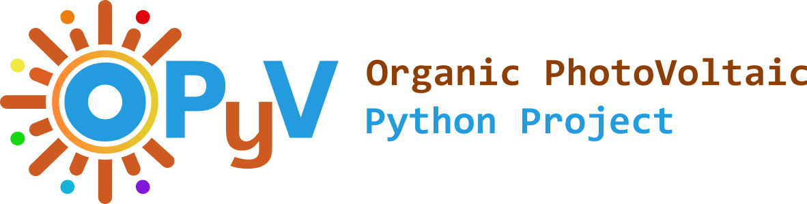

# <a href="https://opyv.org" target="_blank">OPyV</a>

---

A Python library for working with organic photovoltaic materials and device data.

---

<a href="https://bluginbuhl.github.io/opyv" target="_blank">Documentation</a>

<a href="https://opyv.org" target="_blank">Project Website</a>

## Features

* Stay Tuned!
